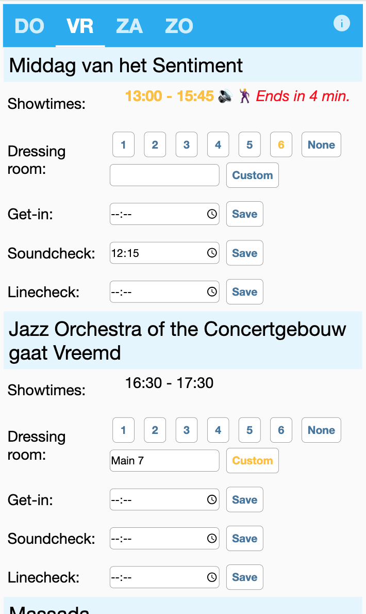
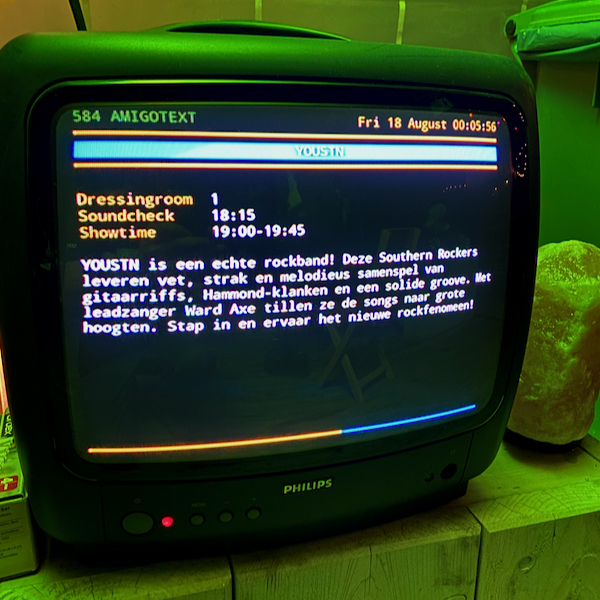

# AmigoText backend
This repository contains the code for a web backend which provides information to a
little infotainment system in the backstage area of a yearly music festival, where I
volunteer. I setup the system with a colleague and we do it just for fun (our actual role
on the festival is being stagehands).

## Background and use
Every year I volunteer as a stagehand at the AMIGO stage of the Zomerparkfeest festival
in Venlo. Together with a colleague, I setup a Raspberry Pi connected to an old TV in our
backstage area, to show some practical information in a fun way. As of 2022, the screens
mimic the look & feel of Teletext (Ceefax) on Dutch public television.

_The frontend (screens) are coded by my colleague and not a part of this repository._

The backend gets the festival programme by fetching and parsing the festival website's
HTML code. It also contains a user interface for entering additional details like dressing
rooms and soundcheck times.
